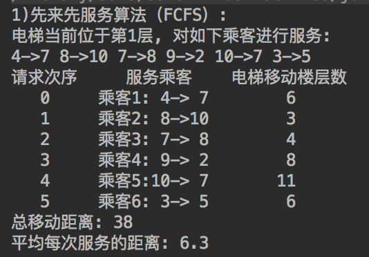
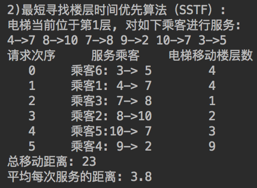
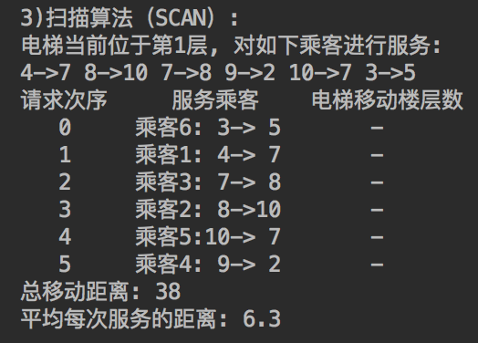

## 精读《电梯调度算法》

文章地址：https://mp.weixin.qq.com/s/h_jlf9EAbE9dg7WJdiHKbg

## 引言

大家一定经历过等电梯的烦恼，尤其是在赶时间的时候，则更为头疼。如果你是一名程序员的话, 你一定有在等电梯时盘算过如何对电梯调度进行优化。

## 常见调度算法简介
文章对各种算法的介绍还算细致, 具体介绍了如何针对不同的情况对电梯的调度算法进行优化，使其能更高效地运作，但并未给出相应的代码。笔者不才，愿对其介绍的几种较易理解的非实时调度算法进行Java代码实现，权当抛砖引玉之效。献丑献丑。

### 1.1 先来先服务算法(FCFS，FCFS-First Come First Serve)

根据乘客请求乘坐电梯的先后次序进行调度。

**优点**：

> 公平、简单，且每个乘客的请求都能依次地得到处理，不会出现某一乘客的请求长期得不到满足的情况。

**缺点**：

> 在载荷较大的情况下，这种算法的性能就会严重下降，甚至恶化。

*(缺点)举个例子*: 电梯处于1楼, A乘客请求从10楼到1楼，B乘客请求从1楼到10楼, C乘客请求从9楼到1楼。根据FCFS算法，电梯会先满足A乘客的请求，再满足B乘客的请求，最后满足C乘客的请求。

**代码**:

```Java
/**
 * 一次任务请求
 *
 * @author relish
 * @since 2018/08/21
 */
public class Task {

    public String name;
    /**
     * 请求所在楼层
     */
    public int from;
    /**
     * 请求去往楼层
     */
    public int to;

    public Task(String name, int from, int to) {
        this.name = name;
        this.from = from;
        this.to = to;
    }

    public Direct getDirect() {
        return from - to > 0 ? Direct.DOWN : Direct.UP;
    }


    @Override
    public String toString() {
        return String.format("%s %d->%d", name, from, to);
    }
}
```

```Java
/**
 * 运动方向
 */
public enum Direct {
    UP,
    DOWN
}
```

```Java
public class FCFS {
    public static void exec(List<Task> taskList, int initPos) {
        System.out.println("1)先来先服务算法（FCFS）:");
        System.out.format("电梯当前位于第%s层, 对如下乘客进行服务:\n", initPos);
        for (Task task : taskList) {
            System.out.format("%d->%d ", task.from, task.to);
        }
        System.out.println("\n请求次序     服务乘客    电梯移动楼层数");

        int totalTime = 0;
        int prev = initPos;
        for (int i = 0; i < taskList.size(); i++) {
            Task task = taskList.get(i);
            int abs = Math.abs(task.from - prev);
            totalTime += abs;
            int d = Math.abs(task.from - task.to);
            totalTime += d;
            prev = task.to;
            System.out.format("   %d     %s:%2d->%2d       %2d\n", i, task.name, task.from, task.to, abs + d);
        }
        System.out.println("总移动距离: " + totalTime);
        double ave = totalTime / 1.0 / taskList.size();
        System.out.format("平均每次服务的距离: %.1f\n", ave);
    }
}
```

**点评**：代码简单。任务执行只需按请求队列的顺序执行即可。



### 1.2 最短寻找楼层时间优先算法（SSTF，Shortest Seek Time First）

此算法选择下一个服务对象的原则是最短寻找楼层的时间。
**优点**：

> 注重电梯寻找楼层的优化。请求队列中距当前能够最先到达的楼层的请求信号就是下一个服务对象。

**缺点**：

> 队列中的某些请求可能长时间得不到响应，出现所谓的“饿死”现象。

*(缺点)补充说明*: 处于中间楼层的请求会被快速响应，但处于底层和上层的请求，会被长时间搁置。

**代码**:

```Java
public class SSTF {
    public static void exec(List<Task> taskList, int initPos) {
        System.out.println("1)先来先服务算法（FCFS）:");
        System.out.format("电梯当前位于第%s层, 对如下乘客进行服务:\n", initPos);
        for (Task task : taskList) {
            System.out.format("%d->%d ", task.from, task.to);
        }
        System.out.println("\n请求次序     服务乘客    电梯移动楼层数");
		
      	//---------------------调度开始-----------------------
        int prev = initPos;
        List<Task> visit = new ArrayList<>();
        for (int i = 0; i < taskList.size(); i++) {
            int min = Integer.MAX_VALUE;
            int shortIndex = 0;
            for (int j = 0; j < taskList.size(); j++) {
                Task task = taskList.get(j);
                if (task == null) continue;
                int curr = Math.abs(task.from - prev);
                if (min > curr) {
                    min = curr;
                    shortIndex = j;
                }
            }
            Task e = taskList.get(shortIndex);
            visit.add(e);
            taskList.set(shortIndex, null);
            prev = e.to;
        }
        taskList.clear();
        taskList.addAll(visit);
      	//---------------------调度结束-----------------------      

        int totalTime = 0;
        int prev = initPos;
        for (int i = 0; i < taskList.size(); i++) {
            Task task = taskList.get(i);
            int abs = Math.abs(task.from - prev);
            totalTime += abs;
            int d = Math.abs(task.from - task.to);
            totalTime += d;
            prev = task.to;
            System.out.format("   %d     %s:%2d->%2d       %2d\n", i, task.name, task.from, task.to, abs + d);
        }
        System.out.println("总移动距离: " + totalTime);
        double ave = totalTime / 1.0 / taskList.size();
        System.out.format("平均每次服务的距离: %.1f\n", ave);
    }
}
```

**点评**: 与FCFS算法相比，SSTF算法会先对请求队列进行排序，每次都会优先处理距离最近的请求。



### 1.3 扫描算法（SCAN）

扫描算法（SCAN）, 也被称为电梯调度算法，是一种按照楼层顺序依次服务请求，它让电梯在最底层和最顶层之间连续往返运行，在运行过程中响应处在于电梯运行方向相同的各楼层上的请求。

**优点**:

> 进行寻找楼层的优化，效率比较高。较好地解决了电梯移动的问题，在这个算法中，每个电梯响应乘客请求使乘客获得服务的次序是由其发出请求的乘客的位置与当前电梯位置之间的距离来决定的。

**缺点**:

> 扫描算法的平均响应时间比最短寻找楼层时间优先算法长。

扫描算法的响应时间方差比最短寻找楼层时间优先算法小，从统计学角度来讲，扫描算法要比最短寻找楼层时间优先算法稳定。

**代码**:

```Java
public class SCAN {
     System.out.println("3)扫描算法（SCAN）:");
        System.out.format("电梯当前位于第%s层, 对如下乘客进行服务:\n", initPos);
        for (Task task : taskList) {
            System.out.format("%d->%d ", task.from, task.to);
        }
        System.out.println("\n请求次序     服务乘客    电梯移动楼层数");
		//---------------------调度开始-----------------------
        List<Task> visit = new ArrayList<>(taskList);
        visit.sort(new ScanComparator(initPos, direct));
        taskList.clear();
        taskList.addAll(visit);
		//---------------------调度结束-----------------------
        int totalTime = 0;
        for (int i = 0; i < taskList.size(); i++) {
            Task task = taskList.get(i);
            int d = Math.abs(task.from - task.to);
            totalTime += d;
            System.out.format("   %d     %s:%2d->%2d       -\n", i, task.name, task.from, task.to);
        }
        totalTime = (max - min) * 2;
        System.out.println("总移动距离: " + totalTime);
        double ave = totalTime / 1.0 / taskList.size();
        System.out.format("平均每次服务的距离: %.1f\n", ave);
}
```

```Java
/**
 * SCAN算法任务排序(调度)比较器
 */
public class ScanComparator implements Comparator<Task> {
    private final int initPos;
    private final Direct direct;

    public ScanComparator(int initPos, Direct direct) {
        this.initPos = initPos;
        this.direct = direct;
    }

    @Override
    public int compare(Task o1, Task o2) {
        int i = ifInitDirectIsUp(o1, o2);
        if (direct == Direct.UP) {
            return i;
        } else {
            return -i;
        }
    }

    public int ifInitDirectIsUp(Task o1, Task o2) {
        int i = biggerOrSmaller(o1, o2);
        Direct d1 = o1.getDirect();
        Direct d2 = o2.getDirect();
        if (d1 == d2) {
            if (d1 == Direct.UP) {
                if (o1.from > initPos) {
                    return i;
                } else {
                    return 1;
                }
            } else {
                if (o1.from > initPos) {
                    return -i;
                } else {
                    return 1;
                }
            }
        } else {
            if (d1 == Direct.UP) {
                if (o1.from > initPos) {
                    return -1;
                } else {
                    return 1;
                }
            } else {
                if (o1.from > initPos) {
                    return 1;
                } else {
                    return -1;
                }
            }
        }
    }


    public int biggerOrSmaller(Task o1, Task o2) {
        if (o1.from > o2.from) {
            return 1;
        } else if (o1.from < o2.from) {
            return -1;
        } else {
            return 0;
        }
    }
}
```



### 总结

文章还介绍了其他两种非实时算法——**LOOK算法**和**SATF算法**。LOOK算法是对SCAN算法的改进，当判定继续往*上/下*走已经没有请求的楼层，便不会继续前行而是转向，而SCAN算法会继续运行到*顶/底*层再转向；SATF(Shortest Access Time First)算法与 SSTF 算法的思想类似，唯一的区别就是 SATF 算法将 SSTF 算法中的寻找楼层时间改成了访问时间。

文章还介绍了几种实时电梯调度算法。基本上是基于前面介绍的几种非实时调度算法的优化和改进。读者如有兴趣，可以对其进行深入研究，细细思考算法的精妙，还颇有趣味。

最后借用精读文章内的一句话来结束此文:  

> 哪个算法都不是一个最佳方案，只是它确实解决了一定情况的问题。但是对一个优秀的程序员而言，研究各种算法是无比快乐的。